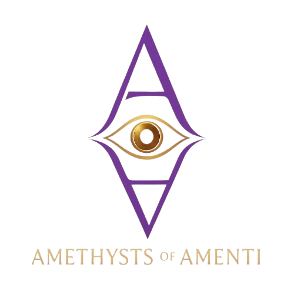

<h1 align="center">HeiroGlyph 1.0</h1>
<h4 align="center">A responsive and modern real-time chat app made with Next.js, Pusher, and Prisma.</h4>

# Features

- [x] Authentication/Singup using github and google.
- [x] Custom login and signup using nodemailer..
- [x] Modern and responsive mobile friendly ui.
- [x] Voice and video call integration using zegocloud.
- [x] Realtime chat using pusher.
- [x] Normal and group chats.
- [x] Supports text and image and voice messages.
- [x] Search indexing for messages, chats and contacts.
- [x] Dark and light mode available.
- [x] Real time event and message notifications.
   
